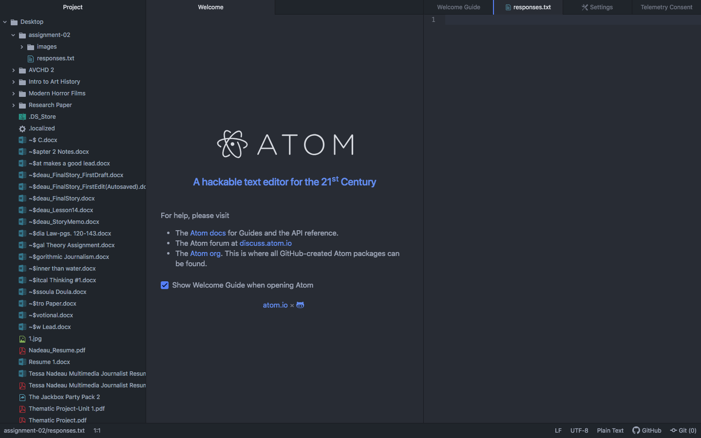

# Assignment 2

## Tessa Nadeau

I am taking this class because I am getting a minor in Media Arts. This is one of the classes that is required but I would have taken it even if it wasn't required. I'm a broadcast journalism major so I think it is important to understand how the web works. In my major we use the internet so much and so I think this class will help me have a better understanding of it which is awesome!

1. I couldn't figure out how to preview the markdown changes and I spent about an hour just trying to change it. It turns out that I never selected the toggle preview button! However, as you can see I figured it out and I feel pretty accomplished!

2. I have also learned how to create repositories and how to name things correctly so they don't get lost!

3. I know that Web Design is much more than the aesthetics but I hope to learn about what makes a site most appealing to viewers.

Absolute URL: [Intro to Web Design Home Page](https://moodle.umt.edu/course/view.php?id=28925#section-0)

Relative URL:
[My Responses File](./responses.txt)

