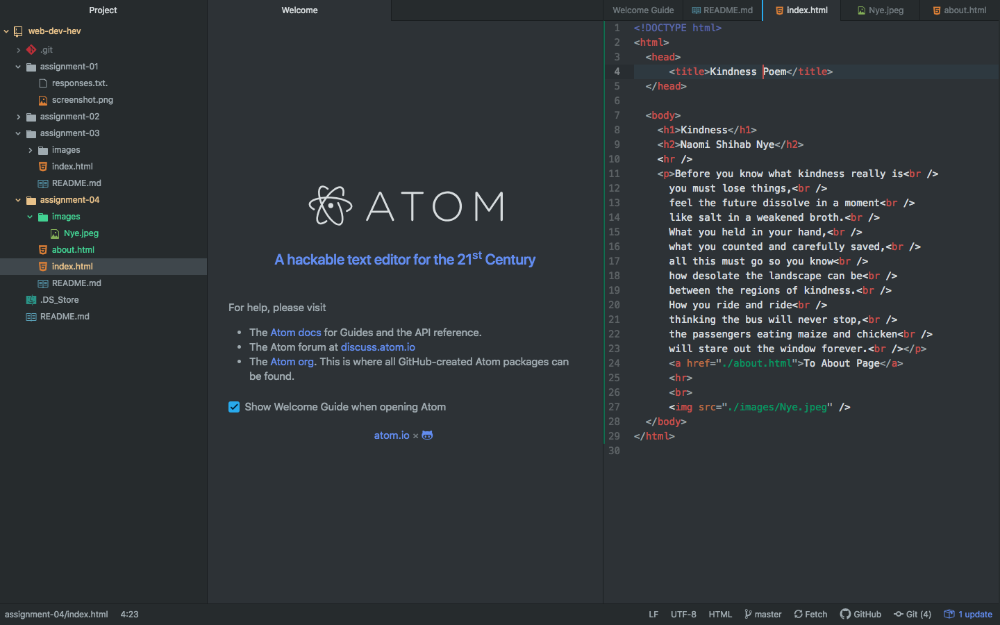

# Assignment 04
## Tessa Nadeau

1. When I used The Wayback Machine I visited the YouTube page from 2005. It looked very outdated (obviously) and the site page didn't extend over the whole screen. It's different from the current YouTube page for a number of different reasons. First, the page title used to be called YouTube - Broadcast Yourself. but is now just YouTube. The overall layout is different as well. Most of the links to other pages used to be above, but now they cover the top and left side of the page.

2. My overall experiance with Git Module was awesome. Everything that was taught was basically new information to me. I learned about the importance of Files, Directories, Documentation and why all of that is important. It was really helpful to create my own website from the ground up because it helped me understand what goes into the whole process. The biggest help has been the tutorials and walkthrough videos. I would be lost without them and I've learned so much using them!

3. 
